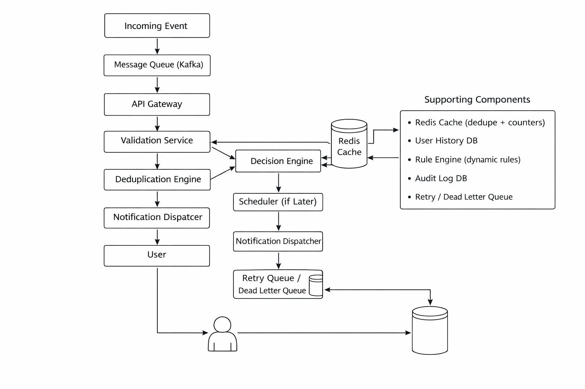

# Notification Prioritization Engine  
Round 1 – Cyepro Solutions  

---

## 1. Problem Understanding

Modern applications generate notifications from multiple services such as messages, reminders, alerts, promotions, and system events.

Users often experience:
- Notification overload  
- Repetitive alerts  
- Poor timing  
- Important alerts being buried  

The system must classify each incoming notification as:

- **NOW** → Send immediately  
- **LATER** → Defer or schedule  
- **NEVER** → Suppress  

The solution must:
- Prevent exact and near-duplicates  
- Reduce alert fatigue  
- Resolve conflicting priorities  
- Support dynamic rule configuration  
- Provide explainable decisions  
- Fail safely under service degradation  
- Scale under high event volume  

---

## 2. High-Level Architecture

### Processing Flow

Incoming Event  
↓  
Message Queue  
↓  
API Gateway  
↓  
Validation Service  
↓  
Deduplication Engine  
↓  
Decision Engine  
↓  
Scheduler (if Later)  
↓  
Notification Dispatcher  
↓  
User  

### Supporting Components

- Redis Cache (dedupe + counters)  
- User History DB  
- Rule Engine (dynamic rules)  
- Audit Log DB  
- Retry / Dead Letter Queue  

---

## Architecture Diagram

---

## 3. Decision Logic Strategy

The system evaluates events in deterministic stages:

1. **Expiry Check**  
   If expired → NEVER  

2. **Duplicate Check**  
   If exact or near duplicate → NEVER  

3. **Urgency Evaluation**  
   If high priority and time-sensitive → NOW  

4. **Alert Fatigue Evaluation**  
   If hourly/daily limits exceeded → LATER  

5. **Promotional Filtering**  
   If promotional during noisy period → LATER or NEVER  

6. **Conflict Resolution**  
   Urgent > Fatigue rules  
   Transactional > Promotional  

7. **Default Case**  
   Send NOW  

Every decision generates an explanation stored in audit logs.

---

## 4. Minimal Data Model

### NotificationEvent
- event_id  
- user_id  
- event_type  
- message  
- source  
- priority_hint  
- timestamp  
- expires_at  
- channel  
- dedupe_key  

### UserNotificationHistory
- user_id  
- last_notification_time  
- hourly_count  
- daily_count  

### SuppressionRecord
- event_id  
- suppression_reason  
- timestamp  

### AuditLog
- event_id  
- decision (Now/Later/Never)  
- explanation  
- decision_time_ms  
- fallback_used  

---

## 5. API Interfaces

POST /events  
GET /audit/{event_id}  
GET /user/{user_id}/history  
POST /rules  
GET /health  

---

## 6. Duplicate Prevention Strategy

### Exact Duplicates
- Use dedupe_key if present  
- Else generate hash(user_id + event_type + message)  
- Store in Redis with TTL (10 min)  

### Near Duplicates
- Compare against recent notifications  
- Similarity threshold > 85% → Suppress  

---

## 7. Alert Fatigue Strategy

- Max 5 notifications per hour  
- Max 20 per day  
- 5-minute cooldown  
- Quiet hours (10PM–7AM)  
- Batch low-priority notifications into digest  

This prevents alert overload while preserving critical alerts.

---

## 8. AI-Native Layer

An AI scoring model evaluates:
- Predicted user engagement  
- Context relevance  
- Historical response behavior  

AI output influences:
- NOW vs LATER classification  
- Promotional suppression  
- Adaptive fatigue limits  

AI decisions are bounded by rule-based safety controls to ensure reliability.

---

## 9. Fallback Strategy

If AI or dependent services fail:

- Timeout at 200ms  
- Switch to deterministic rule engine  
- Route failed dispatches to retry queue  
- Use Dead Letter Queue for repeated failures  
- Never silently drop high-priority alerts  
- Log fallback reason in audit log  

---

## 10. Scalability & Reliability

To handle thousands of events per minute:

- Event ingestion via message queue  
- Stateless services for horizontal scaling  
- Redis cache for low-latency lookups  
- Partitioned databases by user_id  
- Retry and Dead Letter Queues  
- Health checks and monitoring  

---

## 11. Metrics & Monitoring

Key metrics:

- Decision latency  
- Suppression rate  
- Duplicate rate  
- AI fallback rate  
- Delivery success rate  
- System uptime  

Monitoring tools:
- Prometheus  
- Grafana  
- Central logging  

---

## 12. Tradeoffs

- AI accuracy vs latency  
- Aggressive suppression vs missed urgent alerts  
- More rules increase complexity  
- Strong fatigue control vs engagement loss  

---

## 13. Conclusion

This solution provides a scalable, explainable, AI-assisted, and fault-tolerant notification prioritization system that balances urgency, user experience, and operational reliability.
